## Demonstration

### EKS Cluster: telemetry-cluster

`telemetry-cluster` running Kubernetes status Active. Zero cluster health issues, zero node health issues.

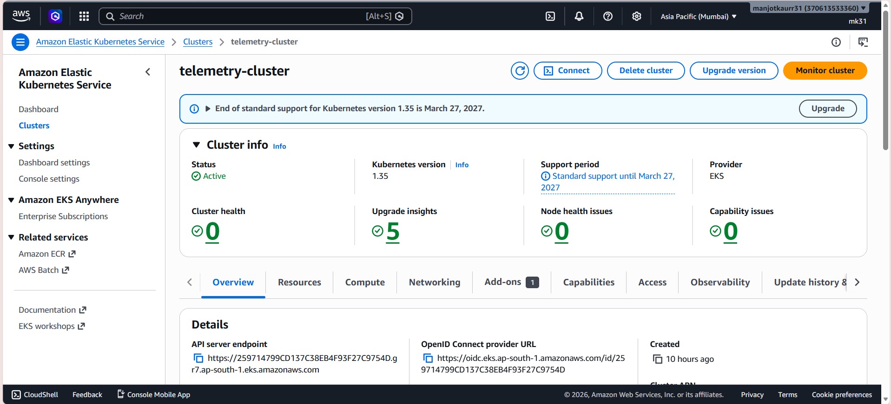

---

### EKS Nodes

Two `t3.small` worker nodes in the `telemetry-ng` managed node group, both Ready.

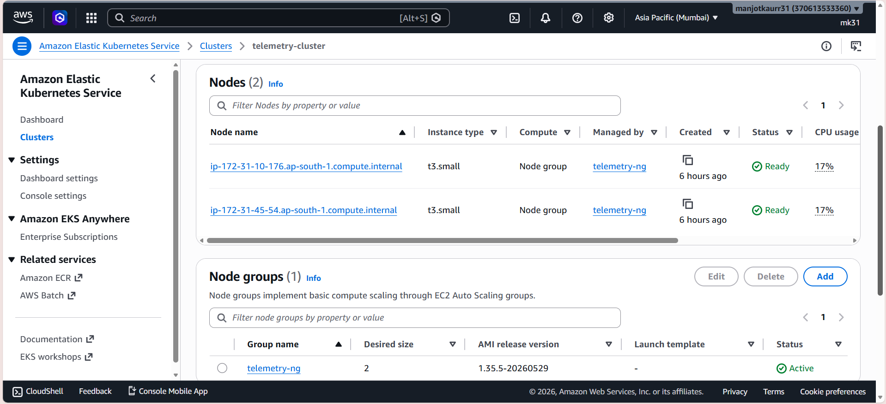

---

### ECR: Docker Images

Two private repositories: `api` and `worker`. Images are pushed by the GitHub Actions CI/CD pipeline on every push to `main`.

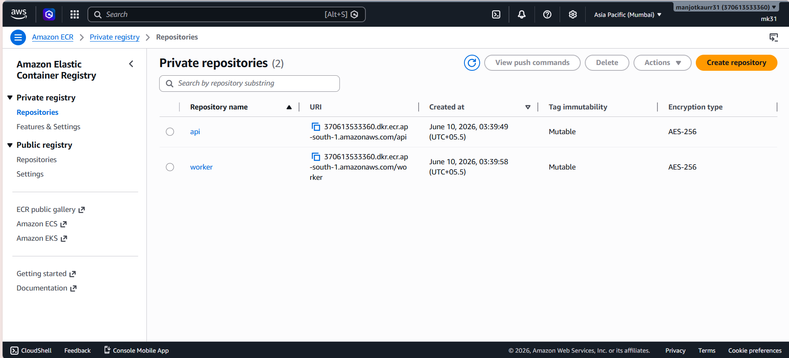

---

### Amazon SQS: Queues

Two queues provisioned with SSE-SQS encryption:

- `telemetry-queue` — main ingestion queue
- `telemetry-dlq` — Dead Letter Queue

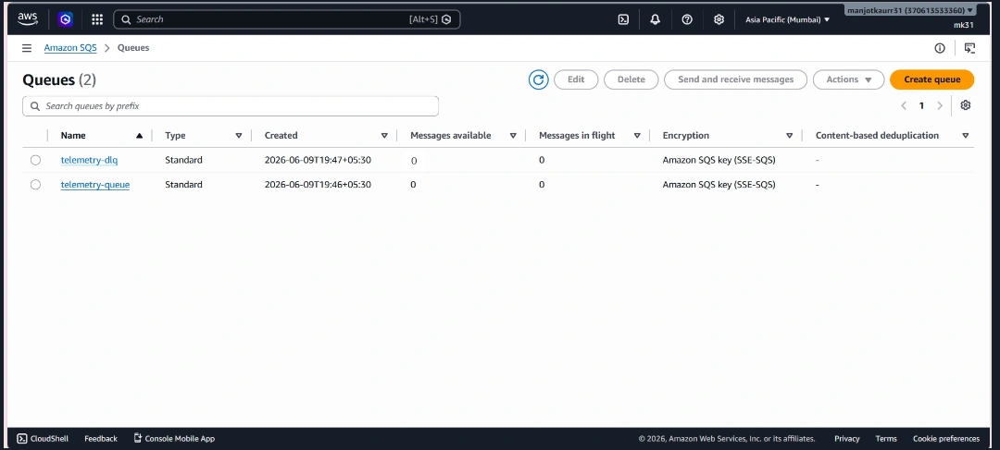

---

### Amazon RDS: telemetrydb

PostgreSQL instance `telemetrydb` status Available.

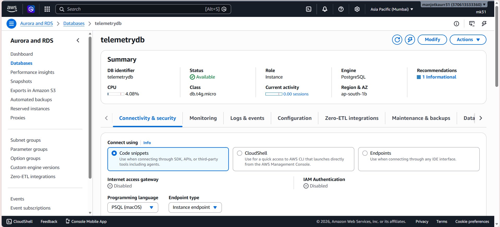

---

### Telemetry Records in PostgreSQL

After a full simulation run, telemetry records are visible in the `public.telemetry` table. Each row captures `device_id`, `device_type`, `recorded_at`, and the full sensor reading in the `payload` jsonb column.

```sql
SELECT * FROM telemetry ORDER BY created_at DESC LIMIT 5;
```

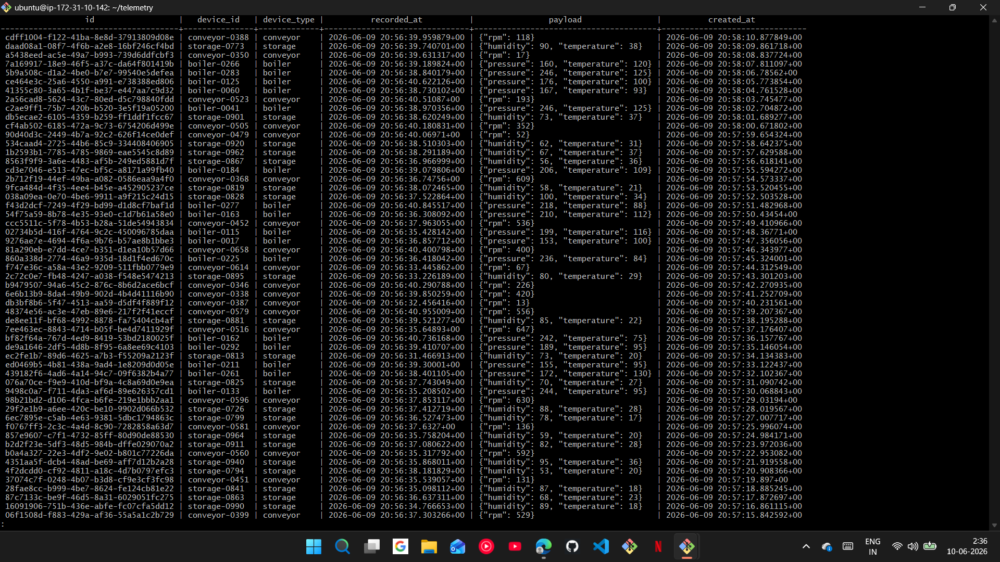

Table schema `\d telemetry`

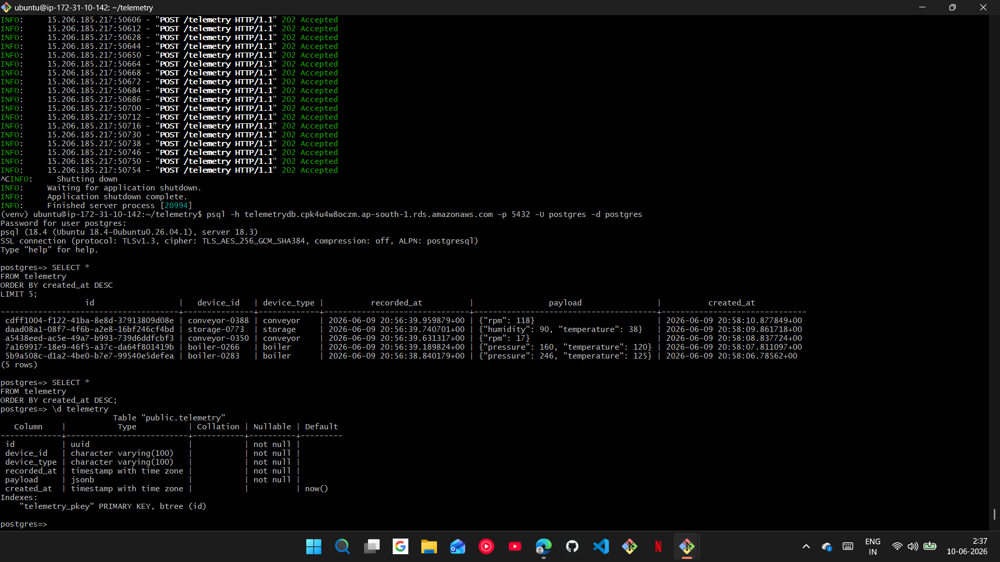

---

### Device Simulator: Complete

The simulator ran to completion: 1,000 logical devices created, 1,000 messages sent. Every device posted its reading to the ingestion API and received `202 Accepted`.

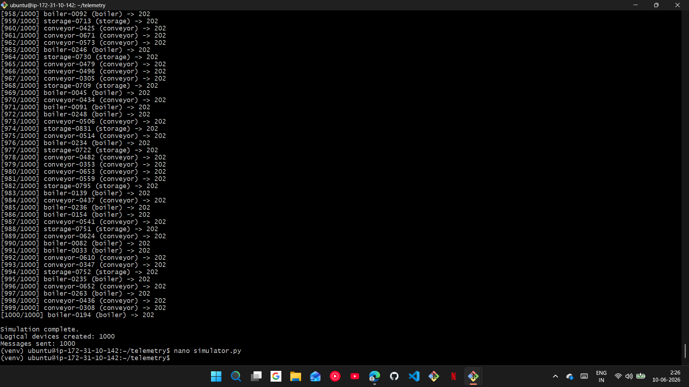

---

### Ingestion API: 202 Accepted

FastAPI access logs confirming every `POST /telemetry` request returned `202 Accepted`. All requests originating from the simulator IP are queued without error.

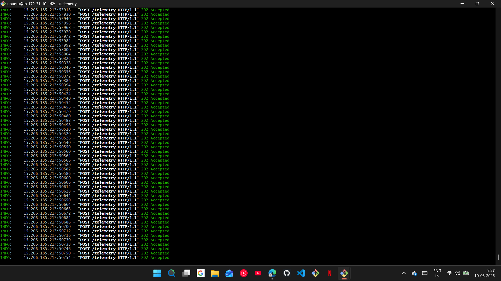

---

### Telemetry Worker: Processing

Worker logs showing continuous `Processed message for device <device_id>` output across all three device types: boilers, conveyors, and storage units.

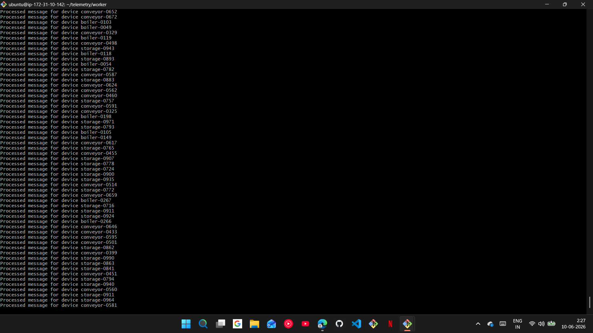

---

### Docker Containers: Local Validation

Before deploying to EKS, both images were built locally and validated with `docker run`. `docker ps` confirms both `telemetry-api` and `telemetry-worker` containers running.

Images were then tagged and pushed to ECR:

```
docker tag telemetry-api:latest   370613533360.dkr.ecr.ap-south-1.amazonaws.com/api:latest
docker tag telemetry-worker:latest 370613533360.dkr.ecr.ap-south-1.amazonaws.com/worker:latest
docker push 370613533360.dkr.ecr.ap-south-1.amazonaws.com/api:latest
docker push 370613533360.dkr.ecr.ap-south-1.amazonaws.com/worker:latest
```
---

### CloudWatch Alarms

Four alarms configured against custom metrics published by the worker:

| Alarm | Condition | State |
|---|---|---|
| Temperature Anomaly | HighTemperature threshold | In alarm |
| Humidity Anomaly | HighHumidity threshold | In alarm |
| RPM Anomaly-High | HighRPM threshold | In alarm |
| RPM Anomaly-LOW | LowRPM threshold | In alarm |

All four alarms triggered, confirming the worker is correctly publishing metrics when device readings exceed thresholds.

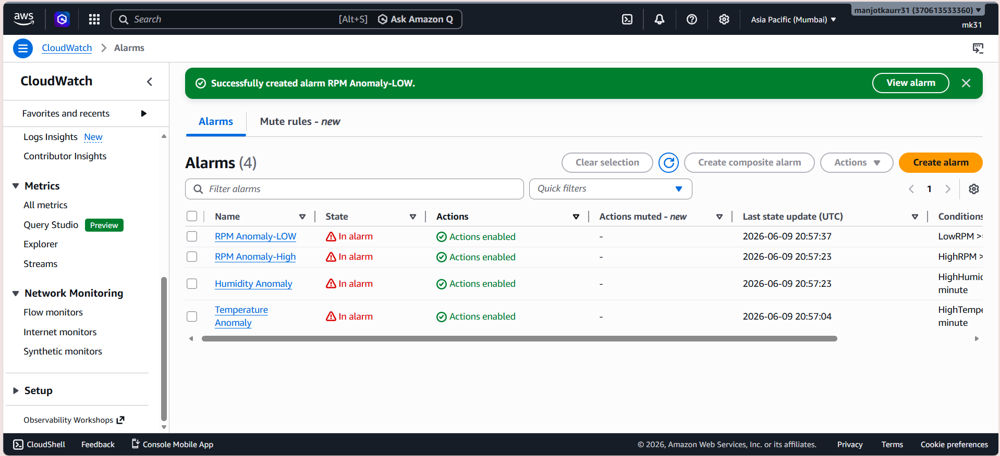

---

### SNS Topic: Default_CloudWatch_Alarms_Topic

CloudWatch alarms publish to the `Default_CloudWatch_Alarms_Topic` SNS topic. One confirmed email subscription (`manjotkaurr31@gmail.com`) receives all alarm notifications.

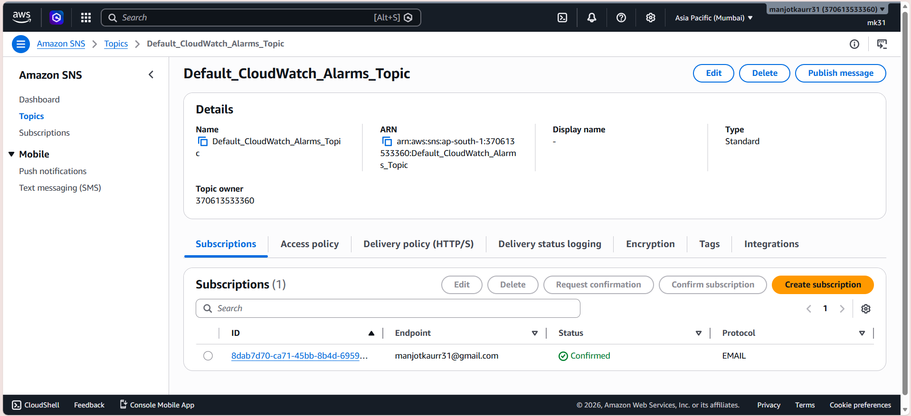

---

### Email Alerts

Gmail inbox showing live alarm notifications from AWS. Alarms - Humidity Anomaly, RPM Anomaly-High, and Temperature Anomaly- fired and delivered to inbox.


**RPM Anomaly-High** alarm email detail. CloudWatch detected the threshold was crossed (`2 datapoints ≥ 1`) and transitioned from `INSUFFICIENT_DATA` to `ALARM`.

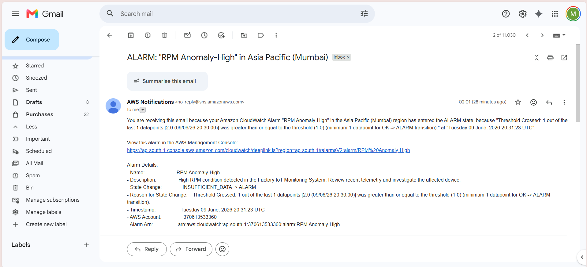

---

### IAM — iot-ec2-role

IAM role attached to the EC2 instance used for local development and ECR push. Five permissions policies attached:

- `AmazonEC2ContainerRegistryFullAccess`
- `AmazonEKSClusterPolicy`
- `AmazonSQSFullAccess`
- `CloudWatchFullAccess`
- `EKSDescribeCluster` (custom inline)

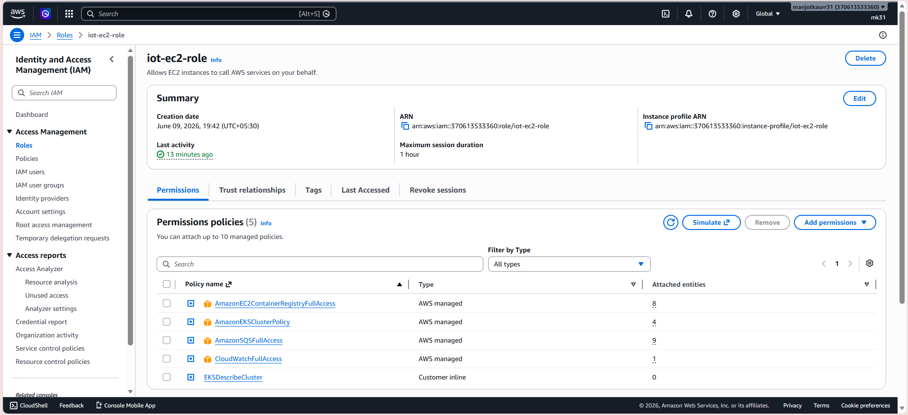

---

### IAM — eks-node-role

IAM role attached to EKS worker nodes. Four AWS managed policies covering ECR read access, CNI networking, and the EKS worker node baseline:

- `AmazonEC2ContainerRegistryReadOnly`
- `AmazonEKS_CNI_Policy`
- `AmazonEKSWorkerNodePolicy`
- `AmazonElasticContainerRegistryPublicReadOnly`

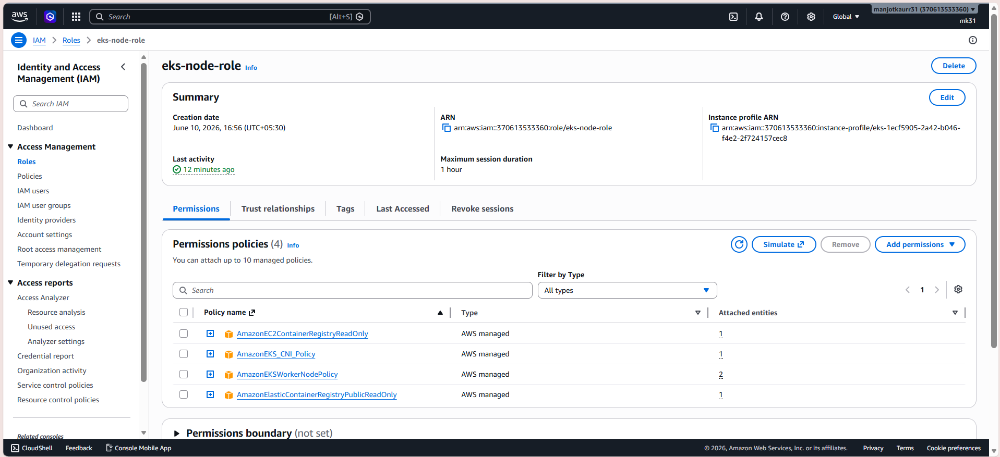

---

### EC2 Instances

Three EC2 instances running in `ap-south-1` - the `telemetry` development instance (`t3.micro`) and two EKS node group instances (`t3.small`), all passing 3/3 status checks.

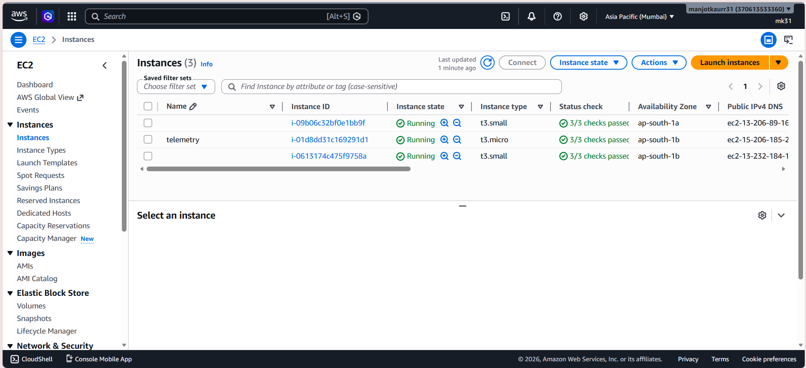
